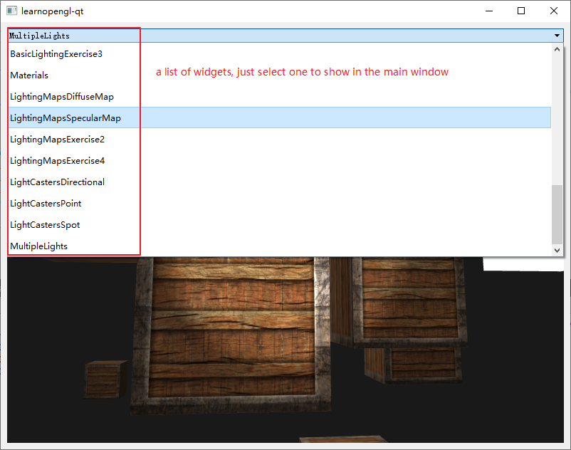

# learnopengl-qt

learn opengl with Qt, and it's directory structure is mostly like the [origin one](https://github.com/JoeyDeVries/LearnOpenGL/tree/master/src).

## How to use

### install libraries

* install [Qt](https://www.qt.io/download)
* install [vcpkg](https://github.com/microsoft/vcpkg)
  * set `VCPKG_ROOT` environment variable to the vcpkg root dir
  * install assimp `vcpkg install assimp`

### run

* open the file ```learnopengl-qt.pro``` with QtCreator
* run it in debug/release mode
* select a widget to show

    

## How to add a new widget

* create a new class like this

    ```c++
    class MultipleLights : public QOpenGLWidget, protected QOpenGLFunctions_3_3_Core
    {
        Q_OBJECT
    public:
        //Q_INVOKABLE is needed
        Q_INVOKABLE MultipleLights(QWidget *parent = nullptr);
        ~MultipleLights();

    protected:
        virtual void initializeGL() override;
        virtual void resizeGL(int w, int h) override;
        virtual void paintGL() override;

    private:
    };
    ```

* inclue it in ```MainWindow.h```

    ```c++
    #include "2.lighting/6.1multiple_lights/MultipleLights.h"
    ```

* add the class name and staticMetaObject to a hashMap in ```MainWindow.cpp```

    ```c++
    void MainWindow::registerMetaObject()
    {
        //add staticMetaObject of the new class you have created to a list
        m_metaObjectList << &MultipleLights::staticMetaObject;

        //then easily traverse the list and add QMetaObject to map and combox
        for(const QMetaObject* mo : m_metaObjectList){
            m_metaObjectMap.insert(mo->className(), mo);
            m_combox->addItem(mo->className());
        }
    }
    ```

## Notes

1. ```glBindFramebuffer(GL_FRAMEBUFFER, 0)``` may not work in QOpenGLWidget, because 0 is not QOpenGLWidget's default framebuffer, use ```glBindFramebuffer(GL_FRAMEBUFFER, defaultFramebufferObject())```instead. Here is my [blog](https://www.cnblogs.com/miyanyan/p/15131720.html)

2. It seems that Qt does not have UBO(uniform buffer object), thus I made a class called ```OpenGLUniformbufferObject```. And, you must pay attention:

    ```c++
    // wrong
    class OpenGLUniformbufferObject : public QOpenGLFunctions_3_3_Core
    {
        //...
        glGetActiveUniformBlockiv(m_shaderId, m_uniformBlockIndex, GL_UNIFORM_BLOCK_DATA_SIZE, &m_uboSize);
    }
    // right
    class OpenGLUniformbufferObject
    {
        //...
        // get current opengl function
        QOpenGLFunctions_3_3_Core* m_glFunc = QOpenGLContext::currentContext()->versionFunctions<QOpenGLFunctions_3_3_Core>();
        m_glFunc->glGetActiveUniformBlockiv(m_shaderId, m_uniformBlockIndex, GL_UNIFORM_BLOCK_DATA_SIZE, &m_uboSize);
    }
    
    ```
